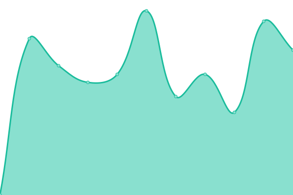

# [📈 Live Status](https://uptime.ransomware.live): <!--live status--> **🟩 All systems operational**

This repository contains the open-source uptime monitor and status page for [Julien Mousqueton](http://www.julien.io), powered by [Upptime](https://github.com/upptime/upptime).

With [Upptime](https://upptime.js.org), you can get your own unlimited and free uptime monitor and status page, powered entirely by a GitHub repository. We use [Issues](https://github.com/JMousqueton/uptime.ransomware.live/issues) as incident reports, [Actions](https://github.com/JMousqueton/uptime.ransomware.live/actions) as uptime monitors, and [Pages](https://uptime.ransomware.live) for the status page.

<!--start: status pages-->
<!-- This summary is generated by Upptime (https://github.com/upptime/upptime) -->
<!-- Do not edit this manually, your changes will be overwritten -->
<!-- prettier-ignore -->
| URL | Status | History | Response Time | Uptime |
| --- | ------ | ------- | ------------- | ------ |
|  [ransomware.live - Main site](https://www.ransomware.live) | 🟩 Up | [ransomware-live-main-site.yml](https://github.com/JMousqueton/uptime.ransomware.live/commits/HEAD/history/ransomware-live-main-site.yml) | 

 653ms
     
 | 

<a href="https://uptime.ransomware.live/history/ransomware-live-main-site">99.39%</a>
    

|  [ransomware.live - Posts](https://posts.ransomware.live) | 🟩 Up | [ransomware-live-posts.yml](https://github.com/JMousqueton/uptime.ransomware.live/commits/HEAD/history/ransomware-live-posts.yml) | 

 394ms
     
 | 

<a href="https://uptime.ransomware.live/history/ransomware-live-posts">100.00%</a>
    

|  [ransomware.live - Data](https://data.ransomware.live) | 🟩 Up | [ransomware-live-data.yml](https://github.com/JMousqueton/uptime.ransomware.live/commits/HEAD/history/ransomware-live-data.yml) | 

 623ms
     
 | 

<a href="https://uptime.ransomware.live/history/ransomware-live-data">99.39%</a>
    

|  [ransomware.live - Images](https://images.ransomware.live) | 🟩 Up | [ransomware-live-images.yml](https://github.com/JMousqueton/uptime.ransomware.live/commits/HEAD/history/ransomware-live-images.yml) | 

 569ms
     
 | 

<a href="https://uptime.ransomware.live/history/ransomware-live-images">100.00%</a>
    

|  [ransomware.live - Static](https://static.ransomware.live) | 🟩 Up | [ransomware-live-static.yml](https://github.com/JMousqueton/uptime.ransomware.live/commits/HEAD/history/ransomware-live-static.yml) | 

 583ms
     
 | 

<a href="https://uptime.ransomware.live/history/ransomware-live-static">100.00%</a>
    

|  [ransomware.live - API](https://api.ransomware.live) | 🟩 Up | [ransomware-live-api.yml](https://github.com/JMousqueton/uptime.ransomware.live/commits/HEAD/history/ransomware-live-api.yml) | 

 582ms
     
 | 

<a href="https://uptime.ransomware.live/history/ransomware-live-api">100.00%</a>
    

|  [Blog Julien Mousqueton](https://julien.io) | 🟩 Up | [blog-julien-mousqueton.yml](https://github.com/JMousqueton/uptime.ransomware.live/commits/HEAD/history/blog-julien-mousqueton.yml) | 

 1955ms
     
 | 

<a href="https://uptime.ransomware.live/history/blog-julien-mousqueton">100.00%</a>
    

<!--end: status pages-->

[**Visit our status website →**](https://uptime.ransomware.live)

## 📄 License

- Powered by: [Upptime](https://github.com/upptime/upptime)
- Code: [MIT](./LICENSE) © [Julien Mousqueton](http://www.julien.io)
- Data in the `./history` directory: [Open Database License](https://opendatacommons.org/licenses/odbl/1-0/)
